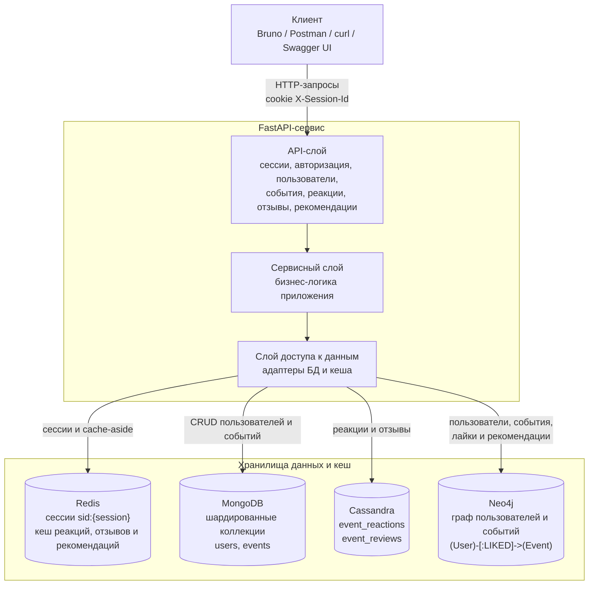
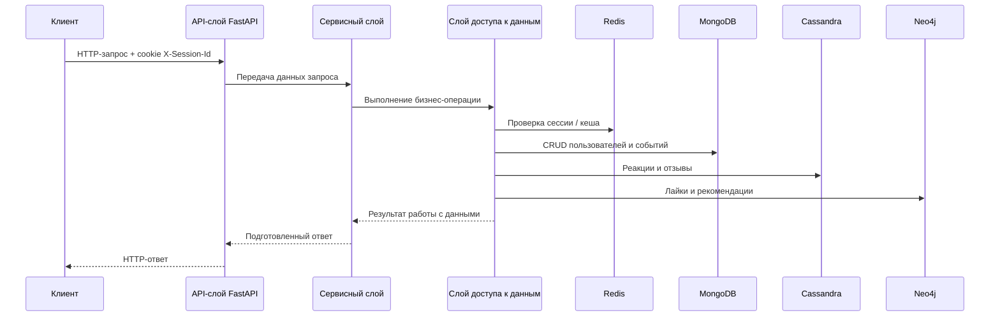

# nosql_labs
[](https://github.com/zhozhyr/nosql_labs/actions/workflows/eventhub.yml)


`nosql_labs` — FastAPI-сервис для лабораторных работ по NoSQL. Приложение хранит пользователей и события в шардированном MongoDB, использует Redis для сессий и кэшей, Cassandra для реакций и отзывов, Neo4j для графа лайков и рекомендаций.

## Технологический стек

| Компонент | Версия / инструмент | Назначение |
| --- | --- | --- |
| Язык | Python 3.13 | Основной язык приложения |
| Web framework | FastAPI >= 0.129.0 | HTTP API, Swagger UI и OpenAPI schema |
| ASGI server | uvicorn >= 0.41.0 | Запуск FastAPI-приложения |
| Package manager | poetry | Установка зависимостей и сборка проекта |
| Контейнеризация | Docker Compose | Подъём приложения и всех хранилищ |
| Redis | redis:7-alpine, `redis>=6.4.0` | Сессии, Cache-Aside для реакций, отзывов и рекомендаций |
| MongoDB | mongo:8, `pymongo>=4.15.0` | Шардированное хранилище пользователей и событий |
| Cassandra | cassandra:4.1, `cassandra-driver>=3.29.2` | Таблицы реакций и отзывов |
| Neo4j | neo4j:5-community, `neo4j>=5.28.1` | Граф `User-[:LIKED]->Event` для рекомендаций |
| Pydantic | pydantic-settings >= 2.13.0 | Схемы ответов API и загрузка конфигурации |
| bcrypt | bcrypt >= 5.0.0 | Хеширование пользовательских паролей |
| Качество кода | flake8, isort, pre-commit | Линтинг, порядок импортов |
| Тестовые инструменты | Bruno, Postman | Юнит-тесты и API smoke-тесты |

## Архитектура проекта



### Структура модулей

| Путь | Что лежит внутри |
| --- | --- |
| `app/main.py` | Точка входа FastAPI-приложения |
| `app/settings.py` | Загрузка конфигурации из `.env.local` |
| `app/health/` | HTTP-обработчик `GET /health` |
| `app/sessions/` | Бизнес-логика сессий и Redis-store |
| `app/users/` | Регистрация, поиск и чтение пользователей |
| `app/auth/` | Логин и логаут |
| `app/events/` | Создание, поиск, фильтрация и обновление событий |
| `app/reactions/` | Лайки/дизлайки, Cassandra-store и Redis-cache |
| `app/reviews/` | Отзывы, рейтинг, Cassandra-store и Redis-cache |
| `app/recommendations/` | Рекомендации, Neo4j graph/store и Redis-cache |
| `scripts/` | Инициализация MongoDB и Cassandra |
| `tools/bruno/` | Bruno-коллекция для API smoke-тестов |
| `api/postman/` | Postman-коллекция для API smoke-тестов |

### Основные сущности

| Сущность | Где хранится | Основные поля | Связи |
| --- | --- | --- | --- |
| `User` | MongoDB `users`, Neo4j `User` | `id`, `full_name`, `username`, `password_hash` | Создаёт события, ставит реакции, пишет отзывы |
| `Session` | Redis | `sid`, `user_id`, TTL | Связана с пользователем после регистрации или логина |
| `Event` | MongoDB `events`, Neo4j `Event` | `title`, `description`, `location`, `started_at`, `finished_at`, `created_by`, `category`, `price` | Создан пользователем, получает реакции и отзывы |
| `Reaction` | Cassandra `event_reactions`, Neo4j edge для лайков | `event_id`, `created_by`, `like_value`, `created_at` | Лайк дополнительно создаёт `(User)-[:LIKED]->(Event)` |
| `Review` | Cassandra `event_reviews` | `event_id`, `created_by`, `rating`, `comment`, timestamps | Один отзыв пользователя на событие |
| `Recommendation` | Neo4j + Redis cache | Список событий | Строится по лайкам похожих пользователей |

### Схема данных
Упрощенная сиквенс-диаграмма


- Redis: ключи `sid:{session_id}` для сессий, кэши агрегатов реакций/отзывов и `user:{user_id}:recomms` для рекомендаций.
- MongoDB: коллекции `users` и `events`; события шардированы по `created_by` и фильтруются по названию, id, категории, цене, городу, дате и автору.
- Cassandra: `event_reactions` хранит реакции (лайки/дизлайки), `event_reviews` хранит отзывы с оценками; `event_reviews_by_id` — вспомогательная таблица для поиска отзыва по id.
- Neo4j: узлы `User`, `Event`, связь `LIKED`; рекомендации ищут пользователей с общими лайками и предлагают их остальные лайки, дедуплицированные по `title`.

## Функциональные требования / Use Cases

| Use Case | Сценарий |
| --- | --- |
| Создание сессии | Анонимный клиент вызывает `POST /session`, получает cookie `X-Session-Id`, Redis хранит сессию с TTL |
| Регистрация | Пользователь отправляет ФИО, username и password; сервис хеширует пароль, создаёт пользователя и авторизованную сессию |
| Авторизация | Пользователь вызывает `POST /auth/login`, сервис проверяет пароль и обновляет/создаёт авторизованную сессию |
| Выход | Пользователь вызывает `POST /auth/logout`, Redis-сессия удаляется, cookie очищается |
| Создание события | Авторизованный пользователь создаёт событие; документ сохраняется в MongoDB, событие синхронизируется в Neo4j |
| Поиск событий | Клиент получает список событий с фильтрами `title`, `id`, `category`, `price_from`, `price_to`, `city`, `date_from`, `date_to`, `user`, `limit`, `offset` |
| Реакции | Авторизованный пользователь ставит лайк или дизлайк; агрегаты кэшируются в Redis, лайк записывается в Neo4j |
| Отзывы | Авторизованный пользователь создаёт или обновляет отзыв; список отзывов и агрегаты рейтинга доступны через API |
| Рекомендации | Авторизованный пользователь получает события, которые лайкали пользователи с похожими интересами |

## API

Swagger UI доступен после запуска приложения:
- Swagger UI: [http://localhost:8080/docs](http://localhost:8080/docs)

Артефакты для тестирования находятся в:
- [api/bruno/nosql_labs](api/bruno/nosql_labs) — Bruno-коллекция
- [api/postman/nosql_labs.postman_collection.json](api/postman/nosql_labs.postman_collection.json) — Postman-коллекция

Основные эндпоинты:

| Метод | Endpoint | Назначение |
| --- | --- | --- |
| `GET` | `/health` | Health-check |
| `POST` | `/session` | Создать или продлить анонимную сессию |
| `POST` | `/users` | Зарегистрировать пользователя |
| `GET` | `/users` | Получить список пользователей |
| `GET` | `/users/{user_id}` | Получить публичный профиль пользователя |
| `GET` | `/users/{user_id}/events` | Получить события пользователя |
| `POST` | `/auth/login` | Авторизоваться |
| `POST` | `/auth/logout` | Выйти из аккаунта |
| `POST` | `/events` | Создать событие |
| `GET` | `/events` | Получить список событий |
| `GET` | `/events/{event_id}` | Получить событие |
| `PATCH` | `/events/{event_id}` | Обновить категорию, цену или город события |
| `POST` | `/events/{event_id}/like` | Поставить лайк |
| `POST` | `/events/{event_id}/dislike` | Поставить дизлайк |
| `POST` | `/events/{event_id}/reviews` | Создать отзыв |
| `GET` | `/events/{event_id}/reviews` | Получить отзывы события |
| `PATCH` | `/events/{event_id}/reviews/{review_id}` | Обновить отзыв |
| `GET` | `/recommendations` | Получить рекомендации |

### Примеры запросов и ответов

Health-check:
```bash
curl -i http://localhost:8080/health
```
```json
{"status":"ok"}
```

Создание сессии:
```bash
curl -i -c /tmp/nosql.cookies -X POST http://localhost:8080/session
```
```http
HTTP/1.1 201 Created
Set-Cookie: X-Session-Id=<sid>; Max-Age=60; Path=/; SameSite=lax
```

Регистрация пользователя:
```bash
curl -i -c /tmp/nosql.cookies \
  -H 'Content-Type: application/json' \
  -d '{"full_name":"Иван Петров","username":"ivan.petrov","password":"secret-password"}' \
  -X POST http://localhost:8080/users
```
```http
HTTP/1.1 201 Created
Set-Cookie: X-Session-Id=<sid>; Max-Age=60; Path=/; SameSite=lax
```

Ошибка при повторной регистрации:
```json
{"message":"user already exists"}
```

Логин:
```bash
curl -i -b /tmp/nosql.cookies -c /tmp/nosql.cookies \
  -H 'Content-Type: application/json' \
  -d '{"username":"ivan.petrov","password":"secret-password"}' \
  -X POST http://localhost:8080/auth/login
```
```http
HTTP/1.1 204 No Content
Set-Cookie: X-Session-Id=<sid>; Max-Age=60; Path=/; SameSite=lax
```

Создание события:
```bash
curl -i -b /tmp/nosql.cookies -c /tmp/nosql.cookies \
  -H 'Content-Type: application/json' \
  -d '{"title":"NoSQL Meetup","address":"Санкт-Петербург, Невский проспект","started_at":"2026-04-01T12:00:00+03:00","finished_at":"2026-04-01T15:00:00+03:00","description":"Встреча про MongoDB, Cassandra и Neo4j"}' \
  -X POST http://localhost:8080/events
```
```json
{"id":"665833bbf6f0f53d9d9ad001"}
```

Получение событий с агрегатами:
```bash
curl -i -b /tmp/nosql.cookies \
  "http://localhost:8080/events?title=NoSQL&include=reactions,reviews&limit=10&offset=0"
```
```json
{
  "events": [
    {
      "id": "665833bbf6f0f53d9d9ad001",
      "title": "NoSQL Meetup",
      "description": "Встреча про MongoDB, Cassandra и Neo4j",
      "location": {
        "address": "Санкт-Петербург, Невский проспект",
        "city": "Санкт-Петербург"
      },
      "created_by": "665833aaf6f0f53d9d9ad000",
      "started_at": "2026-04-01T12:00:00+03:00",
      "finished_at": "2026-04-01T15:00:00+03:00",
      "category": "meetup",
      "price": 0,
      "reactions": {"likes": 3, "dislikes": 1},
      "reviews": {"count": 2, "rating": 4.5}
    }
  ],
  "count": 1
}
```

Лайк события:
```bash
curl -i -b /tmp/nosql.cookies -c /tmp/nosql.cookies \
  -X POST http://localhost:8080/events/665833bbf6f0f53d9d9ad001/like
```
```http
HTTP/1.1 204 No Content
```

Создание отзыва:
```bash
curl -i -b /tmp/nosql.cookies -c /tmp/nosql.cookies \
  -H 'Content-Type: application/json' \
  -d '{"rating":5,"comment":"Полезная встреча, много практики"}' \
  -X POST http://localhost:8080/events/665833bbf6f0f53d9d9ad001/reviews
```
```json
{"id":"66583499f6f0f53d9d9ad002"}
```

Список отзывов:
```bash
curl -i -b /tmp/nosql.cookies \
  "http://localhost:8080/events/665833bbf6f0f53d9d9ad001/reviews?limit=10&offset=0"
```
```json
{
  "reviews": [
    {
      "id": "66583499f6f0f53d9d9ad002",
      "event_id": "665833bbf6f0f53d9d9ad001",
      "comment": "Полезная встреча, много практики",
      "rating": 5,
      "created_at": "2026-04-01T09:00:00+00:00",
      "created_by": "665833aaf6f0f53d9d9ad000",
      "updated_at": "2026-04-01T09:00:00+00:00"
    }
  ],
  "count": 1
}
```

Рекомендации:
```bash
curl -i -b /tmp/nosql.cookies http://localhost:8080/recommendations
```
```json
{
  "events": [
    {
      "id": "66583510f6f0f53d9d9ad003",
      "title": "Graph Databases Night",
      "description": "Разбор графовых моделей на Neo4j",
      "location": {"address": "Москва, Тверская улица"},
      "created_by": "665833aaf6f0f53d9d9ad000",
      "started_at": "2026-04-10T19:00:00+03:00",
      "finished_at": "2026-04-10T21:00:00+03:00"
    }
  ]
}
```

Типовые ошибки:
```http
HTTP/1.1 400 Bad Request
```
```json
{"message":"invalid \"title\" field"}
```
```http
HTTP/1.1 401 Unauthorized
```
```http
HTTP/1.1 404 Not Found
```
```json
{"message":"Event not found"}
```
```http
HTTP/1.1 409 Conflict
```
```json
{"message":"event already exists"}
```

## Инструкция по запуску

Требования:
- Python 3.13
- Docker и Docker Compose

Локальное разворачивание после клонирования:
```bash
git clone https://github.com/zhozhyr/nosql_labs.git
cd nosql_labs
make run
```

`make run` собирает образ приложения и поднимает FastAPI, Redis, MongoDB cluster, Cassandra и Neo4j в фоне.

Полезные команды:
```bash
make run      # запуск всех сервисов в фоне
make rund     # запуск с логами в терминале
make services # статус контейнеров
make stop     # остановка
make clean    # остановка с удалением volumes
make lint     # проверка качества кода средствами isort & flake8
```
## Конфигурация

Основной источник конфигурации — `.env.local`. Приложение загружает переменные через `pydantic-settings`, Docker Compose использует тот же файл как `env_file`.

| Переменная | Описание | Значение по умолчанию |
| --- | --- | --- |
| `APP_HOST` | Хост FastAPI-приложения | `0.0.0.0` |
| `APP_PORT` | Порт FastAPI-приложения | `8080` |
| `APP_USER_SESSION_TTL` | TTL пользовательской сессии в секундах | `60` |
| `APP_LIKE_TTL` | TTL кэша счётчиков реакций в секундах | `60` |
| `APP_EVENT_REVIEWS_TTL` | TTL кэша агрегатов отзывов в секундах | `120` |
| `APP_RECOMMENDATIONS_TTL` | TTL кэша рекомендаций в секундах | `60` |
| `REDIS_HOST` | Hostname Redis внутри Docker-сети | `redis` |
| `REDIS_PORT` | Порт Redis | `6379` |
| `REDIS_PASSWORD` | Пароль Redis |  |
| `REDIS_DB` | Номер Redis database | `0` |
| `MONGODB_HOST` | Hostname `mongos` внутри Docker-сети | `mongodb` |
| `MONGODB_PORT` | Порт `mongos` | `27017` |
| `MONGODB_USER` | Пользователь MongoDB |  |
| `MONGODB_PASSWORD` | Пароль MongoDB |  |
| `MONGODB_DATABASE` | Имя базы приложения | `nosql_labs` |
| `CASSANDRA_HOSTS` | Список Cassandra hosts через запятую | `cassandra-test` |
| `CASSANDRA_PORT` | Порт Cassandra native transport | `9042` |
| `CASSANDRA_USERNAME` | Пользователь Cassandra |  |
| `CASSANDRA_PASSWORD` | Пароль Cassandra |  |
| `CASSANDRA_KEYSPACE` | Keyspace приложения | `testkeyspace` |
| `CASSANDRA_CONSISTENCY` | Уровень согласованности запросов | `ONE` |
| `CASSANDRA_VOLUME` | Docker volume Cassandra | `nosql-labs-cassandra-data` |
| `CASSANDRA_CLUSTER_NAME` | Имя Cassandra cluster | `nosql-labs` |
| `CASSANDRA_HEALTHCHECK_START_PERIOD` | Стартовый период healthcheck Cassandra | `120s` |
| `NEO4J_URL` | Bolt URL Neo4j для приложения | `bolt://neo4j:7687` |
| `NEO4J_USERNAME` | Пользователь Neo4j | `neo4j` |
| `NEO4J_PASSWORD` | Пароль Neo4j | `password` |
| `NEO4J_HOST` | Hostname Neo4j внутри Docker-сети | `neo4j` |
| `NEO4J_BOLT_PORT` | Внешний Bolt-порт Neo4j | `7687` |
| `NEO4J_HTTP_PORT` | Внешний HTTP-порт Neo4j Browser | `7474` |
| `NEO4J_VOLUME` | Docker volume Neo4j | `nosql-labs-neo4j-data` |
| `NEO4J_HEALTHCHECK_START_PERIOD` | Стартовый период healthcheck Neo4j | `60s` |

## Тестирование

Проверка стиля и порядка импортов:
```bash
make lint
```

API smoke через Bruno после `make run` - открыть api/bruno/nosql_labs в приложении Bruno

API smoke через Postman:
```bash
npx newman run api/postman/nosql_labs.postman_collection.json
```

Автоматические проверки через автограйдер [sitnikovik/ndbx](https://github.com/sitnikovik/ndbx):

Что покрыто:
- автоматические проверки корректности API через автограйдер sitnikovik/ndbx;
- smoke-проверки основных API-сценариев: сессии, пользователи, auth, события, реакции, отзывы, рекомендации;
- порядок импортов и стиль кода через isort и flake8.

## Назначение репозитория

Репозиторий используется как учебный проект для лабораторных работ по NoSQL.
